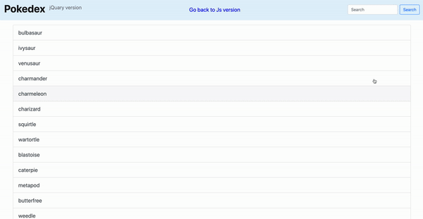

# Pokedex jQuery App
Clone of the [Pokedex-simple-js-app](https://github.com/Funkateer/Pokedex-simple-js-app) using jQuery and Bootstrap4 instead of vanilla javascript


## Screenshots



## Features
- Search for Pokemons
- Display in modals info about Pokemons

## Live Demo
To see the app in action, go to (https://funkateer.github.io/Pokedex-jQuery-app)


## Tech/framework used
```
jQuery
Bootstrap 4
```


## Contribute
1. Fork it (<https://github.com/Funkateer/Pokedex-jQuery-app.git>)
2. Create your feature branch (`git checkout -b feature/fooBar`)
3. Commit your changes (`git commit -am 'Add some fooBar'`)
4. Push to the branch (`git push origin feature/fooBar`)
5. Create a new Pull Request


## License
Distributed under the MIT ©  License.


## Authors
* **Ala Eddin Abugrara** - alaeddin.abugrara@gmail.com

Project Link: https://github.com/Funkateer/Pokedex-jQuery-app


## Contact
Alà Eddin Abugrara Abugrara - [website](http://www.alabugrara.com) - [@twitter](https://twitter.com/twitter_handle) - [Github](https://github.com/Funkateer) - [Linked-in](https://www.linkedin.com/in/al%C3%A0-eddin-abugrara-214ba5115/)


<!-- Markdown links & imgs  -->
